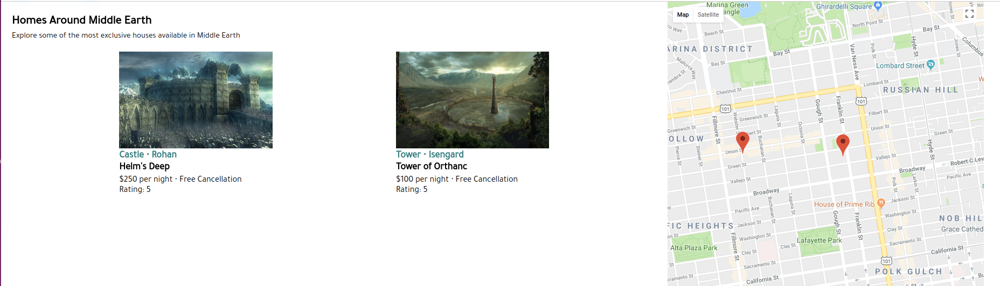
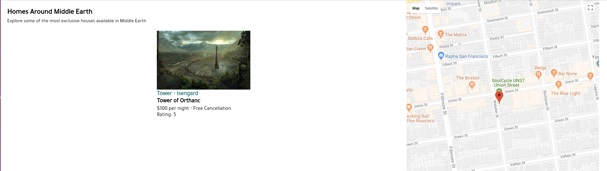
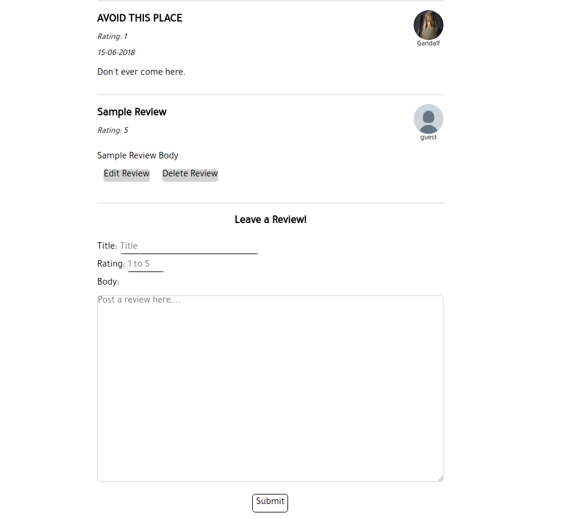
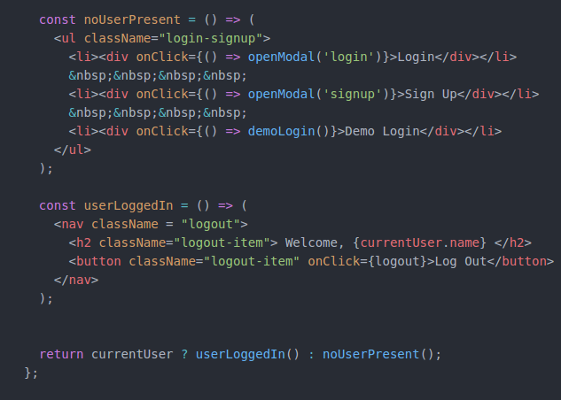

## Lordbnb

Live version: [Lordbnb](https://lordbnb.herokuapp.com/#/ "Lordbnb Homepage")

Lordbnb is a Lord of the Rings themed clone of [Airbnb](https://www.airbnb.com/ "Airbnb Homepage"), which allows for the short-term renting or leasing of a selection of homes to facilitate user experience during travel.  It is built with a Ruby on Rails backend, PostgreSQL databse, and Javascript React/Redux frontend.

## Key Features

* User Authentication
  * Lordbnb's user authentication uses the `BCrypt gem`.
* A moving map that dynamically generates index information using Google Maps API.
* Logged in users can create, update, view, and delete reviews for the locations.
* Users can create a booking for a desired location.

### Interactive Map

Moving the map around can filter locations dynamically while you're on the page.

Map with 2 locations

Map with a single location

This feature was implemented by applying location filters based on the coordinates of the corners of the map view.  Using the four corners as guiding points, only locations with latitude and longitude coordinates within that area are displayed.

### Users can leave reviews

Review Form with a sample review.  Swapping the review for an edit review form.
Users can easily edit their comments by hitting the edit review button.

Reviews display a full CRUD implementation.

Implementation of a Modal for the login and signup of a user.  Using a modal gives a quicker, snappier, and more responsive feel to the website rather than directing the user to another location.

## Project Design

* Lordbnb was created over a 10 day period in June 2018, with a focus on exploring new technologies.  Progress was tracked with an minimum viable product (MVP) list.  Due to time constraints, it was decided to ensure the created features ran smoothly and without bugs.  Making sure the code was fully functioning was the primary concern rather than having advanced features that were not guaranteed to work.

## Technologies

Rails 5.2 was chosen for the backend and PostgreSQL for the database management. jQuery AJAX requests were used to communicate between the backend and the frontend.  Rails sent back responses in JSON format using Rails Jbuilder to the frontend which implemented React, a Javascript library designed by Facebook in March 2013.

React used Redux on the frontend to manage the state.  This allowed for the creation of an app that does not need to render after every user action.  Redux manages the state by incorporating reducers and actions, this keeps everything up to date on both the frontend and backend.

Google Maps API was implemented to register markers with custom latitude and longitude coordinates.  The rendering of the map boundary created a filter to specifically show locations based on the given lat/lng coordinates.

## Future Plans

In the future I want to implement:

* User Profiles
  * Add the ability to view host profiles
  * User profile can view all of their current bookings
* Search Capability
  * A search bar to find make navigating the site even easier and faster
* More Map interaction
  * Allow the map to have more functionality with the markers
  * Adjust markers to be more informative and useful
  * Redo the map to use a customized Middle Earth map
