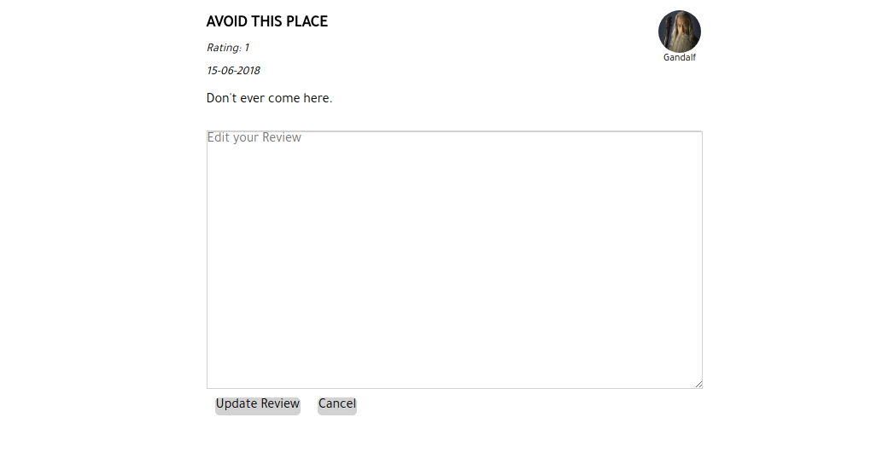

## Lordbnb

Live version: [Lordbnb](https://lordbnb.herokuapp.com/#/ "Lordbnb Homepage")

Lordbnb is a Lord of the Rings themed clone of [Airbnb](https://www.airbnb.com/ "Airbnb Homepage"), which allows for the short-term renting or leasing of a selection of homes to facilitate user experience during travel.  It is built with a Ruby on Rails backend, PostgreSQL databse, and Javascript React/Redux frontend.

## Key Features

* User Authentication
  * Lordbnb's user authentication uses the `BCrypt gem`.
* A moving map that dynamically generates index information.
* Logged in users can create, update, view, and delete reviews for the locations.

### Interactive Map

Moving the map around can filter locations dynamically while you're on the page

Map with 2 locations

Map with a single location

### Users can leave reviews

Review Form with a sample review

Swapping the review for an edit review form

Implementation of a Modal for the login and signup of a user

## Project Design

* Lordbnb was created over a 10 day period in June 2018, with a focus on exploring new technologies.  Progress was tracked with an minimum viable product (MVP) list.  Due to time constraints, it was decided to ensure the created features ran smoothly and without bugs.  Making sure the code was fully functioning was the primary concern rather than having advanced features that were not guaranteed to work.

## Technologies

Rails 5.2 was chosen for the backend and PostgreSQL for the database management. jQuery AJAX requests were used to communicate between the backend and the frontend.  Rails sent back responses in JSON format using Rails Jbuilder to the frontend which implemented React, a Javascript library designed by Facebook in March 2013.

React used Redux on the frontend to manage the state.  This allowed for the creation of an app that does not need to render after every user action.  Redux manages the state by incorporating reducers and actions, this keeps everything up to date on both the frontend and backend.

Google Maps API was implemented to register markers with custom latitude and longitude coordinates.  The rendering of the map boundary created a filter to specifically show locations based on the given lat/lng coordinates.

## Future Plans

In the future I want to implement:

* Booking Capability
  * Users would be able to create and cancel bookings on their account for specified locations
* User Profiles
  * Add the ability to view host profiles
  * User profile can show their current bookings
* Search Capability
  * A search bar to find make navigating the site even easier and faster
* More Map interaction
  * Allow the map to have more functionality with the markers
  * Adjust markers to be more informative and useful
  * Redo the map to use a customized Middle Earth map
